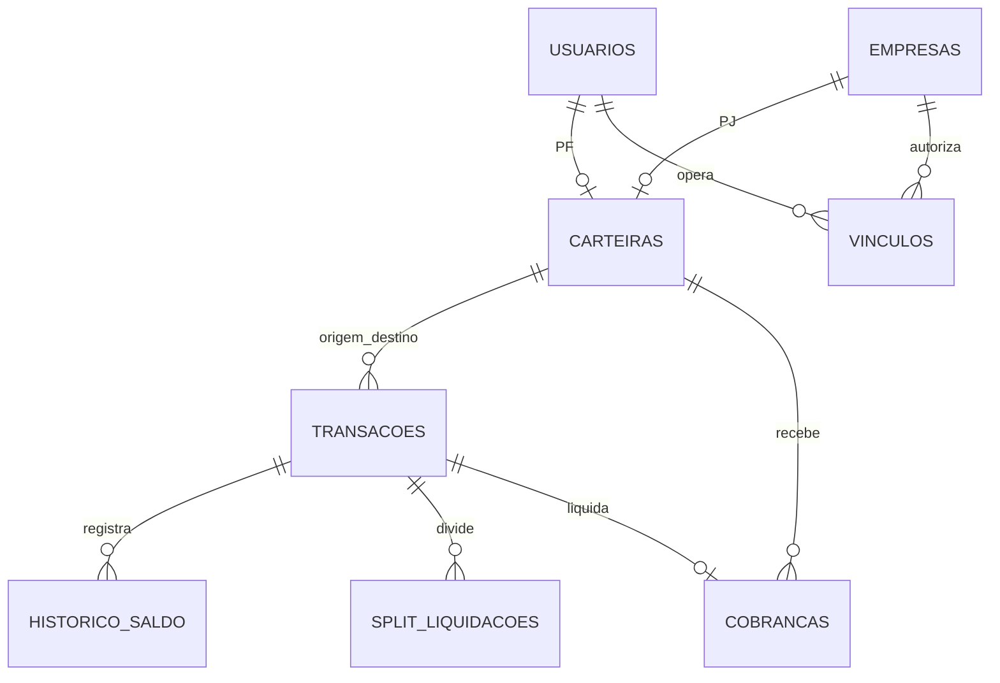

# Banco ASTRO: estrutura e operação

O banco já existia; a revisão fortalece o modelo atual sem trocar o domínio nem
recriar dados de clientes. PostgreSQL 16 é o ambiente de validação. SQLite serve
para desenvolvimento, não comprova concorrência financeira.

## Mapa da aplicação

O site Next.js é institucional. O app React/TanStack acessa a API FastAPI por
`src/lib/api.ts` e `http.ts`; sem configuração de API há demonstração. Android
usa Capacitor. Pessoas autenticam com senha, biometria e prova de posse DPoP;
`X-Conta` seleciona uma empresa autorizada por vínculo ativo.

| Domínio | Tabelas / função |
|---|---|
| Identidade | usuarios, empresas, vinculos, kyc_casos, documentos_identidade, documentos_empresa |
| Conta | carteiras PF/PJ e internas CAIXA, TRIBUTOS, FISCO; limites e cartoes |
| Financeiro | transacoes, historico_saldo, cobrancas, split_liquidacoes, repasses_tributo, creditos_tributarios |
| Operação PJ | operacoes_pendentes, funcionarios, autorizacoes_recorrentes |
| Segurança | dispositivos, refresh_tokens, desafios_biometria, dpop_jtis, sessoes_mfa, logs_auditoria, contestacoes |
| Integração | chaves_pix, webhooks, webhook_entregas |
| Produtos opcionais | rendimentos, produtos, voos, pontos_movimentos |



Transferência comum não retém imposto. Uma cobrança de PJ pode dividir bruto em
líquido, CBS e IBS. O CAIXA financia depósitos/rendimento e pode ficar negativo;
as demais carteiras não. Saldo bloqueado é separado do saldo disponível.

## Contratos protegidos

- Uma carteira por pessoa/empresa; titularidade PF/PJ/SISTEMA exclusiva.
- Valores `NUMERIC(14,2)`, não negativos conforme o domínio; NaN e infinito recusados.
- Bruto = líquido + CBS + IBS; repasse é uma transferência do total já retido,
  sem reter outra vez. Resgate de pontos preserva seu fluxo financeiro existente.
- Chaves estrangeiras também habilitadas no SQLite.
- Uma cobrança paga aponta para uma transação; uma perna por natureza/transação.
- Débitos/créditos/históricos e a auditoria mínima financeira no mesmo commit.
- Linha da transação original travada em liberação, devolução, estorno e MED.
- Decisão MED e seu efeito financeiro no mesmo commit.
- Idempotência compara contas, tipo e composição monetária. Reenvio não pode
  mudar uma transferência em depósito ou alterar o split.
- Rotação de refresh atômica; consumo único do MFA por índice único parcial.
- Histórico e logs append-only em PostgreSQL; a API não altera os valores,
  titulares e autoria de uma transação já registrada.
- Consulta de saldo/período usa índices compostos; timeouts limitam espera por locks.

As restrições estão no contrato imutável `backend/app/db/integridade_v1.py` e na
migração `a8d91f3b2c10`. Não editar esse contrato após implantá-lo; novas regras
precisam de outra versão/migração.

## Docker local

1. Copiar `.env.example` para `.env` (segredos/configuração da API).
2. Copiar `.env.docker.example` para `.env.docker` (senhas do banco).
3. Gerar três senhas distintas com `secrets.token_urlsafe(32)`. Evitar caracteres
   reservados na interpolação Compose; URLs manuais aceitam senhas percent-encoded.
4. Rodar `docker compose --env-file .env.docker up --build`.

O serviço `db` não publica 5432. Seu bootstrap cria `astro_migrator` e
`astro_app`, ambos sem privilégios administrativos. O serviço `migrate` aplica
Alembic e `scripts/restringir_runtime.py`; só então a API inicia com `astro_app`.
A API roda sem capabilities e com filesystem somente leitura.

O `.env` não deve conter senhas bootstrap/migrador: `env_file` carrega todo seu
conteúdo no processo da API. Os exemplos deixam essas credenciais exclusivamente
no `.env.docker`. Não versionar nenhum arquivo preenchido.

O Compose é para desenvolvimento em rede interna local. Produção exige conexão
PostgreSQL com `sslmode=verify-full` e `sslrootcert`; o boot rejeita SQLite,
TLS sem verificação, usuário dono das tabelas, superusuário ou permissão CREATE.
A conexão Azure usa `/etc/ssl/certs/ca-certificates.crt`, presente na imagem.

**Volume existente:** scripts em `/docker-entrypoint-initdb.d` só executam na
primeira criação. Não apagar volumes para adotar essas mudanças. Fazer backup,
provisionar os papéis no banco existente e atribuir a propriedade das tabelas,
sequências e tipos à identidade de migração em uma janela planejada. Aplicar a
migração com essa identidade e executar `scripts/restringir_runtime.py`.
Qualquer dado fora dos novos contratos interrompe a migração e precisa ser
investigado; não há limpeza automática de registros financeiros.

## Conciliação e auditoria

```sh
cd backend
# DATABASE_URL já definida para um banco que você está autorizado a consultar.
python scripts/verificar_banco.py
```

O comando é somente leitura e usa snapshot consistente no Postgres. Verifica:
conservação global do dinheiro, conciliação por movimento, último histórico de
cada carteira, saldos negativos e históricos sem transação. Saída contém
contagens; `exit 1` pede investigação. Executar após migrações/restaurações e
periodicamente com uma credencial apenas de consulta.

Históricos antigos com `transacao_id NULL` são preservados, mas sinalizados.
Não inferir o vínculo usando horário/valor: isso poderia atribuir movimentos
à transação errada. Novas inserções sem transação são recusadas por trigger.
A conciliação não prova sozinha legitimidade do pagamento ou ausência de fraude.

`/saude` informa vida do processo; `/pronto` consulta o banco e responde 503
quando indisponível. Não retorna hostname, credenciais ou detalhes de exceção.

## Azure futuro

Nada foi publicado no Azure nesta revisão.

- O Bicep recebe `pgSenha` para bootstrap e `pgAppSenha` para runtime. A URL da
  API no Key Vault usa `astro_app`; nunca o administrador `astroadmin`.
- Entre os dois passos da infraestrutura, provisionar `astro_app` e
  `astro_migrator` na rede privada, adaptar o SQL de `init-roles.sh` à conta
  administradora do Azure, aplicar migrações e restringir runtime.
- Configurar um Container Apps Job manual com a mesma imagem, identidade própria,
  acesso à VNet e comando `/bin/sh -ec 'alembic upgrade head && python
  scripts/restringir_runtime.py'`. Definir `DATABASE_URL` e
  `DATABASE_MIGRATION_URL` pela referência ao segredo do migrador. O job não
  atende tráfego. `AMBIENTE=desenvolvimento` nesse job evita exigir configurações
  de login da API: apenas Alembic/scripts são executados; não iniciar uvicorn.
- Guardar o segredo de migração em cofre separado, ou conceder RBAC por segredo.
  A identidade da API não deve poder lê-lo. O template atual do cofre da API
  contém apenas JWT, chave biométrica, senha do admin da aplicação e URL runtime.
- Definir `AZURE_MIGRATION_JOB` no GitHub. O workflow só atualiza a revisão da
  API depois de uma execução `Succeeded` desse job, usando a imagem do commit.
- Restringir origem ao gateway, verificar IP real e impedir acesso que contorne
  o WAF. FDID conhecido não autentica a conexão; a API agora exige proxy confiável.
- Validar a cadeia de CA atual do Azure e o hostname com TLS `verify-full`.
- Definir RPO/RTO, retenção e alta disponibilidade conforme uso. A infraestrutura
  atual é de pentest, não uma configuração bancária de alta disponibilidade.
- Testar restauração em banco separado e rodar conciliação antes de liberar uso.

Backup não equivale a restauração validada. Não executar `docker compose down -v`
em banco com dados a preservar. A migração nova suporta downgrade de esquema,
mas rollback de aplicação exige avaliar os dados e a compatibilidade, não apenas
rodar downgrade automaticamente.

## Limites e próximas decisões de produto

O app ainda simula integrações Pix/boleto/cartão e o repasse ao Fisco; validação
local da chave fiscal não autentica a nota perante um emissor externo. Não é
uma integração de liquidação real. Biometria nos testes usa stub: a suíte não
mede taxas de falso aceite nem resistência física a spoofing.

Dados cadastrais consultáveis e segredo HMAC de webhook permanecem no banco.
Produção exige controle de acesso, disco/backups criptografados, retenção e
minimização de dados. Uma camada de criptografia de campos com chaves separadas
e rotação deve ser definida com os requisitos de busca/recuperação; isso não foi
implantado aqui. O template facial já usa Fernet e senhas usam Argon2id.

A trilha financeira é atômica, e todos os webhooks
usam outbox transacional: a entrega é gravada na mesma transação do movimento
(`executar_movimento(evento=...)`), então um crash depois do commit não perde o aviso
(o job `/admin/jobs/webhooks` entrega) e um reenvio idempotente não duplica. O receptor
deve deduplicar pelo `X-PayFlow-Entrega`. `cobranca.estornada` e `operacao.pendente`
seguem o mesmo caminho (estorno e pendência gravam o aviso no próprio commit). Operações PJ ficam `executando` até o
resultado persistir. Crash nesse intervalo é fechado pelo job
`POST /admin/jobs/conciliar-pendentes` (`pagamento_service.conciliar_executando`):
passados `PENDENTE_EXECUTANDO_MIN` (10) minutos, procura as transações pela chave
idempotente `pendente-{id}` na carteira da empresa; achou, vira `aprovada` com os
ids; não achou, vira `falhou` (nada saiu). Nunca reexecuta. Mudança de acesso não
tem transação: vira `falhou` pedindo conferência em Equipe. Folhas/lotes
continuam retornando resultados por item, sem promessa de all-or-nothing.

O backend usa uma identidade compartilhada para operar várias contas; autorização
por objeto é na API. RLS multi-tenant não foi inserido de forma superficial, pois
pagamentos legítimos atravessam titulares. Uma futura defesa com RLS/funções
restritas precisa preservar esses fluxos e evitar privilégios BYPASSRLS.

Segurança não tem garantia absoluta. Esta revisão acrescenta evidências e controles;
pentest independente, validação de modelos biométricos, observabilidade e recuperação
fazem parte da preparação antes de operar com pessoas/dinheiro reais.

## Referências técnicas

- [PostgreSQL: constraints](https://www.postgresql.org/docs/16/ddl-constraints.html)
- [PostgreSQL: privilégios](https://www.postgresql.org/docs/16/ddl-priv.html)
- [Azure PostgreSQL: TLS e verificação de certificado](https://learn.microsoft.com/en-us/azure/postgresql/security/security-tls-how-to-connect)
- [Azure Container Apps Jobs](https://learn.microsoft.com/en-us/azure/container-apps/jobs)

KYC/KYB em análise não libera movimentação em produção: pagamentos verificam o
estado dos titulares dentro da operação financeira. Login/consulta do andamento
continuam disponíveis. Chaves Pix e-mail/celular são recusadas em produção até
haver verificação de posse por canal externo; aceitar apenas texto declarado
permitiria reivindicar o identificador de terceiros.
